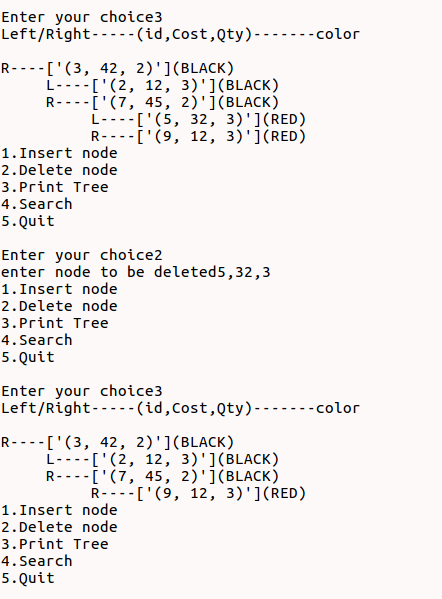
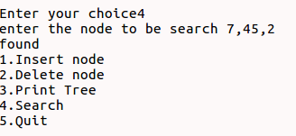

# Red-Black-Tree

Aim: 
	Write a program to implement & Analysis RBT and to store the details of product (id,cost,qty).

Objectives:
    • Initialization Red Black Tree
    • Perform primitive operations of RBT such as Insertion, Deletion and searching.
    • Display the details of products (id,cost,qty) in RBT format.

Methodology:
A red–black tree is a kind of self-balancing binary search tree. Each node in RBT has an extra bit as compare to BST,
and that bit is color (red or black) of the node.

Properties:
    • Binary Search Tree : every RBT should be binary search tree
    • Color Property : every node is either red or black
    • Root Node : root node of RBT is always black
    • Internal Node : If a node is Red then its both children are black
    • Black Depth Property : for each node, all path from that node to descendants external nodes contains the same no
                            of black tree.

Time Complexity of operations:
Insertion - O(logn)
Deletion - O(logn)
Searching - O(logn) 

Results:
Insertion:

Deletion:

Search:

Conclusion:
	Here we can conclude that time complexity of all operations of RBT is depend upon the no of node present in it.    	
